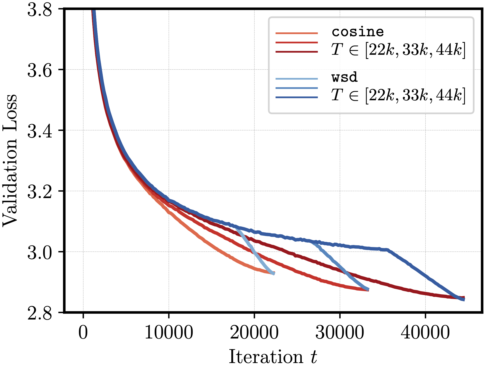
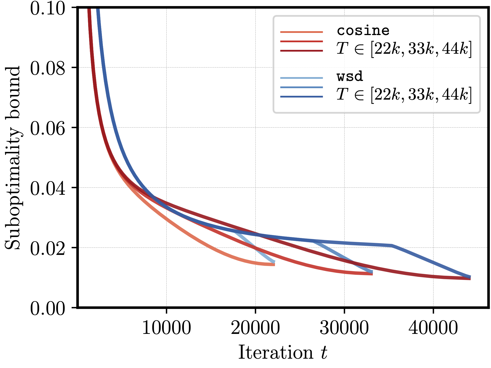

# Learning Rate Scheduling

Code for

**The Surprising Agreement Between Convex Optimization Theory and Learning-Rate Scheduling for Large Model Training**

*by Fabian Schaipp, Alexander Hägele, Adrien Taylor, Umut Simsekli, Francis Bach*.

<p align="center">
    
    
</p>

*Fig 1: WSD and cosine schedule: Empirical performance (left) vs. theoretical bound from convex optimization (right).*


## Summary

#### Package for schedules and bounds.

Code for constructing learning-rate schedules and computing their bound (see Thm. 1 in the paper) can be found in `src/scheduled/`. 

Basic usage of the package is explained below in the section **Basic Example**. The package can be installed locally via

```
   python -m pip install --editable .
```

Check if the installation was successfull by running ``pytest tests -v`` (requires `pytest` package).

#### Theoretical simulations.

All simulations in the paper can be reproduced with 

```
cd scripts/
./run_all.sh
```

The folder `scripts/` also contains the code for each of the simulations. The plots are saved in the folder `plots/`.

#### Experiments.

All training logs can be found in the folder `data/`. The scripts for reproducing all plots related to real training runs are in `reanalysis/`. For example, see [this script](reanalysis/analysis_horizon_transfer.py) for the performance of the theoretically optimal LR schedule extension.

Further ressources:

* **[Training code]**: we use the code from https://github.com/epfml/schedules-and-scaling. Please also see https://arxiv.org/pdf/2405.18392 for more details.
* **[Dataset]**: For our extended training runs we augment the [SlimPajama-6B](https://huggingface.co/datasets/DKYoon/SlimPajama-6B) dataset with data from the larger [SlimPajama-627B](https://huggingface.co/datasets/cerebras/SlimPajama-627B), in order to ensure single-pass training.

## Basic Example

This example gives a short intro to how to use the package. First, to construct the WSD schedule with 20% cooldown, run

```python
from scheduled import CosineSchedule, WSDSchedule
T = 100 # number of total steps
S = WSDSchedule(final_lr=0.0, steps=T+1, cooldown_len=0.2, base_lr=1.0)
```
Other schedule (`ConstantSchedule`, `CosineSchedule`, `SqrtSchedule`) can be done analogously. See their docstrings for explanation of all arguments.

It is possible to set the base learning-rate via `S.set_base_lr(new_base_lr)`. The schedule can then be accessed and plotted via

```python
S.schedule # array with the LR schedule (already multiplied by base_lr)
S.plot()
```

The bound of this schedule at iteration `t<=T` with constant `D` and `G` (see paper for what they mean) can be computed via
```python
G = 1
D = 1
t = 50
S.compute_rate(grad_norms=G, D=D, T=t)
```

New schedules can be added easily, see the remarks in `src/scheduled/base.py` which implements the base class (and thereby a function to compute the bound).
